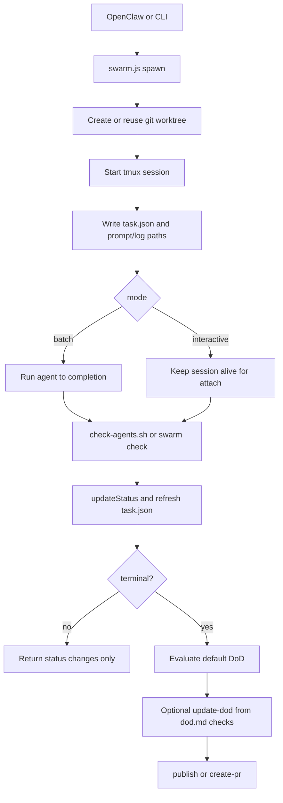

# openclaw-agent-swarm

Unified OpenClaw skill for running coding agents in isolated `git worktree + tmux` tasks.

This repository now ships a single implementation that supports both task modes:
- `interactive`: long-lived tmux session, supports `attach`
- `batch`: non-interactive agent run inside tmux, no `attach`

Chinese documentation is available at [docs/README.zh-CN.md](docs/README.zh-CN.md).

## Architecture

Both task modes now use the same task model, storage layout, and status convergence loop. The main difference is only how the agent session is driven and whether `attach` is allowed.



## DoD

`agent-swarm` supports two DoD layers:

- Default built-in DoD enforced by `swarm.ts`
- Custom task-specific DoD defined in `dod.md` and written back through `update-dod`

Default built-in DoD checks:

- task status must be terminal
- worktree must be clean
- every command in `required_tests` must exit `0`

Custom DoD flow:

1. Put the task-specific acceptance criteria in `dod.md`.
2. Let OpenClaw or your own automation read `dod.md` after the task reaches terminal status.
3. Run any additional semantic checks you need.
4. Write the result back with `update-dod`.

Example `dod.md`:

```md
# DoD

- API endpoint `/healthz` returns `200`
- `npm test` passes
- `README.md` includes the new setup step
```

Example write-back:

```bash
node "$SKILL_ROOT/scripts/swarm.js" update-dod \
  --id <task-id> \
  --status pass \
  --result '{"summary":"dod.md checks passed","error":""}'
```

DoD result conventions:

- `dod.status` is only `pass` or `fail`
- system exceptions are recorded in `dod.result.error`
- `required_tests` is the command-level hard gate passed during `spawn`

## Requirements

- macOS or Linux
- Node.js `>= 18`
- `git`
- `tmux`
- At least one agent CLI installed and available in `PATH`
- Supported agents: `codex`, `claude`

The target repository must already be a valid git repository. `agent-swarm` refuses to run outside git worktrees.

## Install

Clone from GitHub:

```bash
git clone https://github.com/youzaiAGI/openclaw-agent-swarm-skills.git
cd openclaw-agent-swarm-skills
```

Install build dependencies:

```bash
cd code
npm install
cd ..
```

Build the runtime artifact:

```bash
./scripts/build-skill.sh
```

Install the generated skill into your OpenClaw skills directory:

```bash
mkdir -p "$HOME/.openclaw/skills"
rm -rf "$HOME/.openclaw/skills/openclaw-agent-swarm"
cp -R skills/openclaw-agent-swarm "$HOME/.openclaw/skills/openclaw-agent-swarm"
```

## Quick Start

Use this flow if you want to install the skill and start one task immediately.

Set the installed skill root:

```bash
SKILL_ROOT="$HOME/.openclaw/skills/openclaw-agent-swarm"
```

Start a batch task with a hard test gate:

```bash
node "$SKILL_ROOT/scripts/swarm.js" spawn \
  --repo /path/to/repo \
  --mode batch \
  --task "Implement feature X" \
  --agent codex \
  --required-test "npm test"
```

Check progress:

```bash
node "$SKILL_ROOT/scripts/swarm.js" status --id <task-id>
```

If the task uses custom acceptance criteria in `dod.md`, write the result back after validation:

```bash
node "$SKILL_ROOT/scripts/swarm.js" update-dod \
  --id <task-id> \
  --status pass \
  --result '{"summary":"dod.md checks passed","error":""}'
```

Publish the finished branch:

```bash
node "$SKILL_ROOT/scripts/swarm.js" publish --id <task-id> --auto-pr
```

## Runtime Layout

Generated skill payload:

- `skills/openclaw-agent-swarm/SKILL.md`
- `skills/openclaw-agent-swarm/scripts/swarm.js`
- `skills/openclaw-agent-swarm/scripts/check-agents.sh`

Runtime state on the local machine:

- `~/.agents/agent-swarm/tasks/<task-id>.json`
- `~/.agents/agent-swarm/tasks/history/<yyyy-mm-dd>/<task-id>.json`
- `~/.agents/agent-swarm/logs/<task-id>.log`
- `~/.agents/agent-swarm/logs/<task-id>.exit`
- `~/.agents/agent-swarm/prompts/<task-id>.txt`
- `~/.agents/agent-swarm/worktree/<repo-name>/<task-id>/`
- `~/.agents/agent-swarm/agent-swarm-last-check.json`

## Command Usage

Set the installed skill root:

```bash
SKILL_ROOT="$HOME/.openclaw/skills/openclaw-agent-swarm"
```

Main entrypoint:

```bash
node "$SKILL_ROOT/scripts/swarm.js" <command> ...
```

`spawn`

Use `spawn` to create a new task with a fresh worktree. This is the normal entrypoint for both `batch` and `interactive`.

Create a batch task:

```bash
node "$SKILL_ROOT/scripts/swarm.js" spawn \
  --repo /path/to/repo \
  --mode batch \
  --task "Implement feature X" \
  --agent codex \
  --required-test "npm test"
```

Use `--required-test` when the task must satisfy command-level checks before DoD can pass.

Create an interactive task:

```bash
node "$SKILL_ROOT/scripts/swarm.js" spawn \
  --repo /path/to/repo \
  --mode interactive \
  --task "Investigate and patch bug Y" \
  --agent claude
```

`attach`

Use `attach` only for a running `interactive` task when you want to send more instructions into the live tmux session.

Attach to a running interactive task:

```bash
node "$SKILL_ROOT/scripts/swarm.js" attach \
  --id <task-id> \
  --message "Narrow the scope to the API layer first"
```

`spawn-followup`

Use `spawn-followup` after a previous task has already converged and you want to continue with a new task. `new` creates a new worktree, `reuse` keeps working in the previous one if the reuse guard allows it.

Create a follow-up task from a terminal task:

```bash
node "$SKILL_ROOT/scripts/swarm.js" spawn-followup \
  --from <task-id> \
  --worktree-mode new \
  --task "Address review feedback"
```

`status` and `check`

Use `status` for one task and `check --changes-only` for periodic polling or heartbeat-driven incremental updates.

Check status:

```bash
node "$SKILL_ROOT/scripts/swarm.js" status --id <task-id>
node "$SKILL_ROOT/scripts/swarm.js" check --changes-only
```

`update-dod`

Use `update-dod` after your own `dod.md` validation has completed. This does not replace built-in checks; it adds task-specific semantic results.

Update DoD:

```bash
node "$SKILL_ROOT/scripts/swarm.js" update-dod \
  --id <task-id> \
  --result-file /path/to/dod-result.json
```

`cancel`

Use `cancel` when you want to stop a running task and force it to converge to `stopped`.

Cancel a task:

```bash
node "$SKILL_ROOT/scripts/swarm.js" cancel --id <task-id> --reason "manual stop"
```

`publish` and `create-pr`

Use `publish` after the task is done and DoD is satisfied. `create-pr` is the explicit PR creation step if you do not want `publish --auto-pr`.

Publish or create a PR:

```bash
node "$SKILL_ROOT/scripts/swarm.js" publish --id <task-id> --auto-pr
node "$SKILL_ROOT/scripts/swarm.js" create-pr --id <task-id>
```

## OpenClaw Integration

For periodic status convergence, configure OpenClaw heartbeat to call the skill-local wrapper:

```bash
bash "$HOME/.openclaw/skills/openclaw-agent-swarm/scripts/check-agents.sh"
```

This wrapper uses `flock` so only one check cycle runs at a time.

## License

See [LICENSE](LICENSE).

## Star History

[](https://www.star-history.com/#youzaiAGI/openclaw-agent-swarm-skills&Date)
