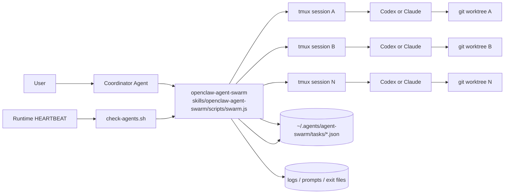
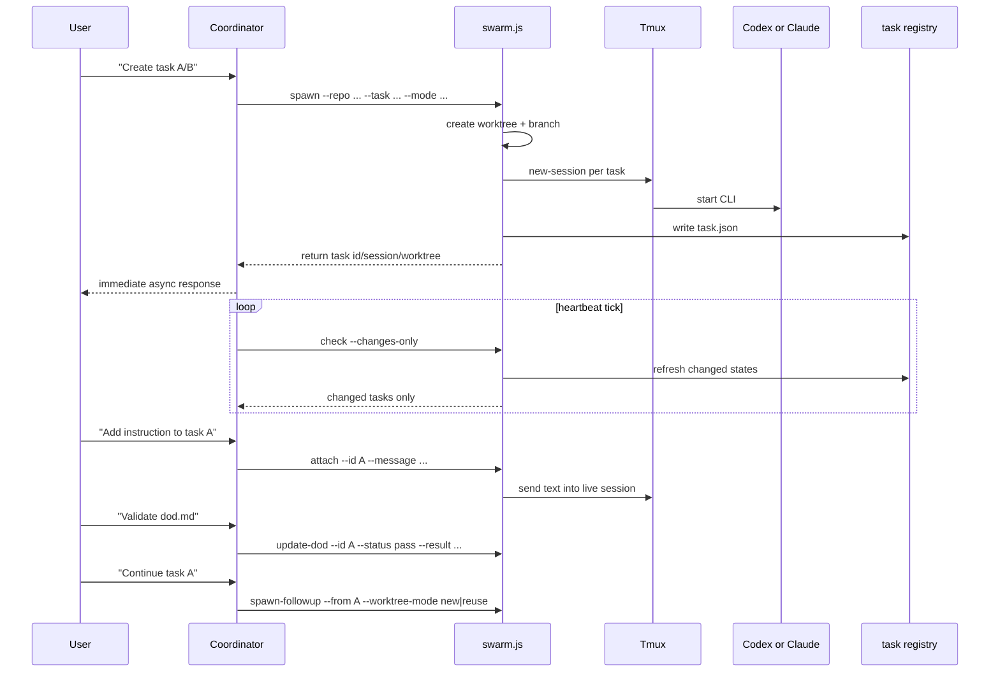

# openclaw-agent-swarm

English | [简体中文](docs/README.zh-CN.md)

A swarm skill for orchestrating coding agents from OpenClaw, Codex, Claude Code, or similar runtimes:
- run `codex` and `claude` tasks in isolated `git worktree + tmux` environments
- support both `interactive` and `batch` task modes in the same skill
- attach new instructions to a running interactive task
- track incremental status through heartbeat polling
- continue finished tasks through guarded follow-up flows
- support built-in DoD plus custom `dod.md` checks

This repository now ships a single skill:
- `openclaw-agent-swarm`

Both task modes are implemented by the same `swarm.js` entrypoint:
- `interactive`: long-lived tmux session, supports `attach`
- `batch`: non-interactive run in tmux, no mid-task `attach`

## 0. Terminology

`DoD` means `Definition of Done`: the objective completion criteria a task must satisfy before it is considered complete.

This project supports two DoD layers:
- built-in DoD enforced by `swarm.ts`
- task-specific DoD defined in `dod.md` and written back through `update-dod`

Task states are fixed:
- `running`
- `pending`
- `success`
- `failed`
- `stopped`

## 1. Goal

When a coordinator agent/runtime needs to drive one or more engineering tasks asynchronously, this skill provides a controllable execution layer with isolation, visibility, and explicit task state.

Design goals:
- Async by default: `spawn` returns immediately
- Isolation: one task, one worktree, one branch, one tmux session
- Unified runtime: one skill handles both `interactive` and `batch`
- Human-in-the-loop: add instructions with `attach` when interactive work is still running
- Deterministic monitoring: `check --changes-only` reports only changed tasks
- Extensible completion: built-in checks handle command-level gates, `dod.md` handles semantic acceptance

## 2. Architecture



## 3. End-to-End Flow



## 4. Repository Layout

```text
.
├── code/                                # source of truth
│   ├── src/swarm.ts                     # TypeScript implementation
│   ├── package.json                     # build toolchain
│   └── tsconfig.json
├── scripts/
│   ├── build-skill.sh                   # build and sync runtime artifact
│   ├── regression-swarm-concurrency.sh  # runtime regression script
│   └── README.md
├── skills/openclaw-agent-swarm/         # ship-ready skill payload
│   ├── SKILL.md
│   ├── scripts/swarm.js
│   ├── scripts/check-agents.sh
│   └── references/
│       ├── dod.md
│       └── state-format.md
├── docs/
│   └── README.zh-CN.md
└── legacy/                              # old code and old docs kept for cleanup history
```

Build flow:
- `code/src/swarm.ts` -> `skills/openclaw-agent-swarm/scripts/swarm.js`

## 5. Core Behavior

### 5.1 Task Model

Tasks are stored in:
- `~/.agents/agent-swarm/tasks/<task_id>.json`

Key fields:
- `id`, `mode`, `agent`, `status`
- `repo`, `worktree`, `branch`, `base_branch`
- `tmux_session`
- `task`, `parent_task_id`
- `required_tests`
- `created_at`, `updated_at`, `last_activity_at`, `timeout_since`
- `log`, `exit_file`, `exit_code`, `result_excerpt`
- `dod`, `publish`, `pr`, `cancel`

### 5.2 State Machine

States:
- `running`
- `pending`
- `success`
- `failed`
- `stopped`

Rules:
- `batch` converges from exit file and tmux liveness
- `interactive` remains attachable while the session is alive
- terminal tasks are re-evaluated for default DoD on refresh
- `check --changes-only` is incremental and backed by `last-check.json`

### 5.3 DoD

Built-in DoD passes only if:
- task status is terminal
- worktree is clean
- every command in `required_tests` exits `0`

Custom DoD flow:
- define semantic acceptance in `dod.md`
- validate it outside the task runtime
- call `update-dod` to write back `pass|fail`

Conventions:
- `dod.status` only allows `pass|fail`
- system exceptions must be recorded in `dod.result.error`

### 5.4 Follow-up and Worktree Reuse

For follow-up on finished tasks:
- do not silently `attach`
- return follow-up choices instead
- user can choose:
  - `new`: create a new worktree and branch
  - `reuse`: continue on the existing worktree if the guard allows it

Reuse guard:
- worktree exists and is still a git worktree
- worktree is clean
- parent tmux session is not alive
- branch is still resolvable

## 6. Quick Start

Install the skill:

```bash
git clone https://github.com/youzaiAGI/openclaw-agent-swarm-skills.git
cd openclaw-agent-swarm-skills
cd code
npm install
cd ..
./scripts/build-skill.sh
mkdir -p "$HOME/.openclaw/skills"
rm -rf "$HOME/.openclaw/skills/openclaw-agent-swarm"
cp -R skills/openclaw-agent-swarm "$HOME/.openclaw/skills/openclaw-agent-swarm"
```

Set skill root:

```bash
SKILL_ROOT="$HOME/.openclaw/skills/openclaw-agent-swarm"
```

Start one batch task:

```bash
node "$SKILL_ROOT/scripts/swarm.js" spawn \
  --repo /path/to/repo \
  --mode batch \
  --task "Implement feature X" \
  --agent codex \
  --required-test "npm test"
```

Check progress:

```bash
node "$SKILL_ROOT/scripts/swarm.js" status --id <task-id>
```

If the task uses `dod.md`, write the result back:

```bash
node "$SKILL_ROOT/scripts/swarm.js" update-dod \
  --id <task-id> \
  --status pass \
  --result '{"summary":"dod.md checks passed","error":""}'
```

Publish the finished branch:

```bash
node "$SKILL_ROOT/scripts/swarm.js" publish --id <task-id> --auto-pr
```

## 7. Command Usage

Set skill root:

```bash
SKILL_ROOT="$HOME/.openclaw/skills/openclaw-agent-swarm"
```

Main entrypoint:

```bash
node "$SKILL_ROOT/scripts/swarm.js" <subcommand> ...
```

`spawn`

Use `spawn` to create a new task in a new worktree. This is the primary entrypoint for both `batch` and `interactive`.

```bash
node "$SKILL_ROOT/scripts/swarm.js" spawn \
  --repo /path/to/repo \
  --mode batch \
  --task "Implement custom template feature" \
  --agent codex \
  --required-test "npm test"
```

```bash
node "$SKILL_ROOT/scripts/swarm.js" spawn \
  --repo /path/to/repo \
  --mode interactive \
  --task "Investigate and patch bug Y" \
  --agent claude
```

`attach`

Use `attach` only for a running `interactive` task. It sends more instructions into the live tmux session.

```bash
node "$SKILL_ROOT/scripts/swarm.js" attach \
  --id <task-id> \
  --message "Prioritize the API layer first"
```

`spawn-followup`

Use `spawn-followup` after a task has already converged and you want to continue from it.

```bash
node "$SKILL_ROOT/scripts/swarm.js" spawn-followup \
  --from <task-id> \
  --task "Address review feedback" \
  --worktree-mode new
```

```bash
node "$SKILL_ROOT/scripts/swarm.js" spawn-followup \
  --from <task-id> \
  --task "Continue on the same branch" \
  --worktree-mode reuse
```

`status` and `check`

Use `status` for one task lookup. Use `check --changes-only` for polling or heartbeat-driven updates.

```bash
node "$SKILL_ROOT/scripts/swarm.js" status --id <task-id>
node "$SKILL_ROOT/scripts/swarm.js" status --query keyword
node "$SKILL_ROOT/scripts/swarm.js" check --changes-only
node "$SKILL_ROOT/scripts/swarm.js" list
```

`update-dod`

Use `update-dod` after your own `dod.md` validation finishes.

```bash
node "$SKILL_ROOT/scripts/swarm.js" update-dod \
  --id <task-id> \
  --status pass \
  --result '{"summary":"dod.md checks passed","error":""}'
```

`cancel`

Use `cancel` when you want to stop a running task and converge it to `stopped`.

```bash
node "$SKILL_ROOT/scripts/swarm.js" cancel \
  --id <task-id> \
  --reason "manual stop"
```

`publish` and `create-pr`

Use `publish` after task completion and DoD pass. Use `create-pr` when you want explicit PR creation instead of `publish --auto-pr`.

```bash
node "$SKILL_ROOT/scripts/swarm.js" publish \
  --id <task-id> \
  --auto-pr
```

```bash
node "$SKILL_ROOT/scripts/swarm.js" create-pr \
  --id <task-id>
```

## 8. Heartbeat Integration

Configure polling in your runtime heartbeat with the shipped wrapper:

```bash
bash "$HOME/.openclaw/skills/openclaw-agent-swarm/scripts/check-agents.sh"
```

This wrapper uses `flock` so only one check cycle runs at a time.

Recommended use:
- run from your runtime heartbeat
- use `check --changes-only` semantics for incremental reporting

If your runtime uses a `HEARTBEAT.md`, ensure it includes:

```bash
bash "$HOME/.openclaw/skills/openclaw-agent-swarm/scripts/check-agents.sh"
```

## 9. Natural Language Mapping

Suggested intent mapping:
- "Create tasks in parallel" -> `spawn`
- "Check progress" -> `status`
- "Add instruction to this task" -> `attach`
- "Cancel this task" -> `cancel --id`
- "Continue this finished task" -> `spawn-followup`
- "Check changes only" -> `check --changes-only`
- "Publish this finished task" -> `publish --auto-pr`
- "Create PR for this task" -> `create-pr`

Agent selection in chat is explicit:
- "Use codex for this task" -> `spawn --agent codex`
- "Use claude for this task" -> `spawn --agent claude`

## 10. Requirements

- macOS or Linux
- Node.js `>= 18`
- `git`
- `tmux`
- at least one of `codex` or `claude`

The target path must already be a git repository.

## 11. Safety Notes

- The runtime is designed for trusted local development environments.
- Background task logs may contain code and context; apply your own retention policy.
- Generated `.js` files under `skills/` are runtime artifacts and should not be edited directly.

## 12. Star History

[](https://www.star-history.com/#youzaiAGI/openclaw-agent-swarm-skills&Date)
