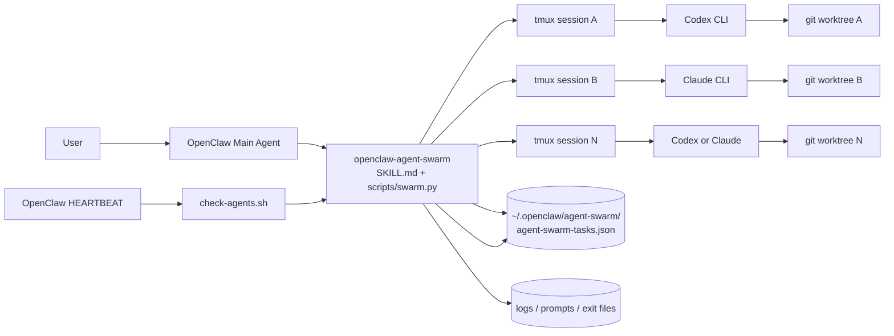
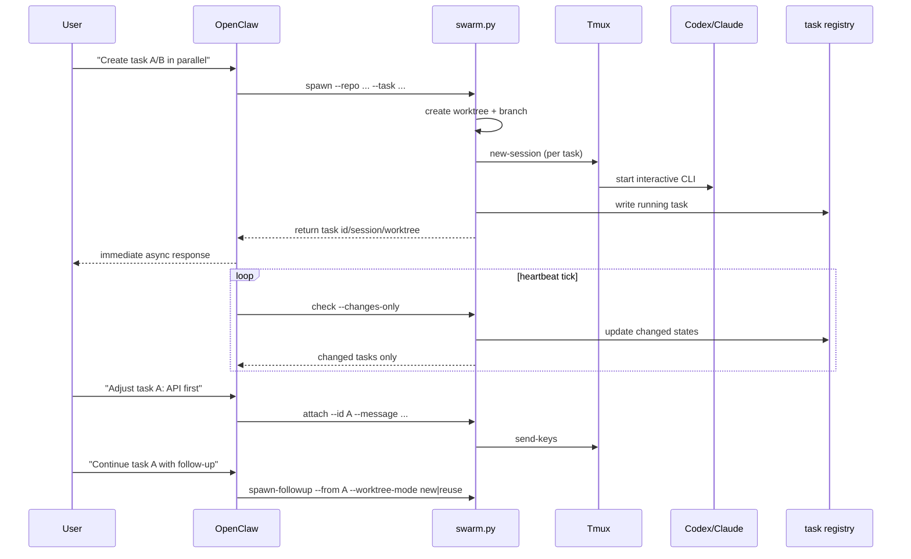

# openclaw-agent-swarm

English | [简体中文](./README.zh-CN.md)

An OpenClaw skill for orchestrating multiple coding agents in parallel:
- Run Codex and Claude Code tasks concurrently
- Isolate each task with its own git worktree + tmux session
- Support mid-task redirection via `attach`
- Track incremental status via heartbeat polling (`check --changes-only`)
- Continue finished tasks through follow-up flows (new or reused worktree)

## 1. Goal

This skill provides a controllable execution layer when OpenClaw needs to drive multiple engineering tasks in parallel.

Design goals:
- Async by default: `spawn` returns immediately
- Isolation: one task, one worktree, one branch, one tmux session
- Human-in-the-loop: send follow-up instructions while task is running
- Deterministic monitoring: heartbeat checks and reports only changes
- Continuation support: finished tasks can continue via guarded follow-up

## 2. Architecture



## 3. End-to-End Flow



## 4. Repository Layout

```text
.
├── SKILL.md                     # OpenClaw-facing skill instructions and chat mapping
├── scripts/
│   ├── swarm.py                 # Main orchestrator CLI
│   ├── check-agents.sh          # Heartbeat entrypoint (check --changes-only)
└── references/
    └── state-format.md          # JSON output schema reference
```

## 5. Core Behavior

### 5.1 Task Model

Tasks are stored in:
- `~/.openclaw/agent-swarm/agent-swarm-tasks.json`

Key fields:
- `id`, `agent`, `status`
- `repo`, `worktree`, `branch`, `base_branch`
- `tmux_session`
- `log`, `exit_file`
- `created_at`, `updated_at`, `last_activity_at`
- `dod` (default definition-of-done result)

### 5.2 State Machine

States:
- `running`
- `awaiting_input`
- `auto_closing`
- `success`
- `failed`
- `stopped`
- `needs_human`

Rules:
- tmux alive does not mean task still in progress
- completion is inferred from multiple signals (log semantics, idle time, exit file, process state)
- auto-close attempts to release tmux session
- unresolved close conditions escalate to `needs_human`

### 5.3 Default DoD

A task passes DoD only if:
- status is `success`
- task branch has at least one commit ahead of base branch
- worktree is clean (`git status --porcelain` empty)

### 5.4 Follow-up and Worktree Reuse

For follow-up on finished tasks:
- do not silently `attach`
- return `requires_confirmation`
- user chooses:
  - `new` (recommended): create new worktree/branch
  - `reuse`: continue on existing worktree with guardrails

Reuse guardrails:
- worktree exists and is a git worktree
- worktree is clean
- parent tmux session is not running
- branch is resolvable

## 6. CLI Usage

Set skill root:

```bash
SKILL_ROOT="$HOME/.openclaw/skills/openclaw-agent-swarm"
```

Spawn:

```bash
python3 "$SKILL_ROOT/scripts/swarm.py" spawn \
  --repo /path/to/repo \
  --task "Implement custom template feature" \
  --agent codex
```

Attach:

```bash
python3 "$SKILL_ROOT/scripts/swarm.py" attach \
  --id 20260305-123456-ab12cd \
  --message "Prioritize API layer first"
```

Status:

```bash
python3 "$SKILL_ROOT/scripts/swarm.py" status --id 20260305-123456-ab12cd
python3 "$SKILL_ROOT/scripts/swarm.py" status --query templates
```

Follow-up:

```bash
python3 "$SKILL_ROOT/scripts/swarm.py" spawn-followup \
  --from 20260305-123456-ab12cd \
  --task "Address review feedback" \
  --worktree-mode new
```

Heartbeat check:

```bash
python3 "$SKILL_ROOT/scripts/swarm.py" check --changes-only
bash "$SKILL_ROOT/scripts/check-agents.sh"
```

## 7. Heartbeat Integration (Required)

This repository does not ship a local `HEARTBEAT.md`.
Configure polling in OpenClaw's built-in `HEARTBEAT.md`:

```bash
bash "$HOME/.openclaw/skills/openclaw-agent-swarm/scripts/check-agents.sh"
```

Recommended interval: every 5-10 minutes.

## 8. Natural Language Mapping (OpenClaw)

Suggested intent mapping:
- "Create tasks in parallel" -> `spawn`
- "Check progress/status" -> `status`
- "Add new instruction to this task" -> `attach`
- "Continue this finished task" -> `spawn-followup`
- "Check changes only" -> `check --changes-only`

For ambiguous task queries, return candidate tasks and ask user to pick one.

## 9. Requirements

- `python3`
- `git` (required)
- `tmux` (required)
- at least one of `codex` or `claude`

## 10. Safety Notes

- Agent CLIs run with dangerous/non-interrupting flags by default to avoid blocking background execution.
- This design is for trusted local development environments.
- Logs may contain code and context; apply your own retention/cleanup policy.

## 11. Roadmap

Potential extensions:
- PR + CI integration via `gh`
- auto-retry policies with retry caps
- pluggable context enrichment hooks
- finer-grained alert policies (human-actionable only)
