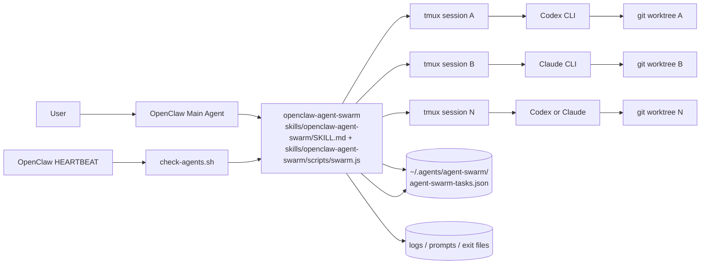
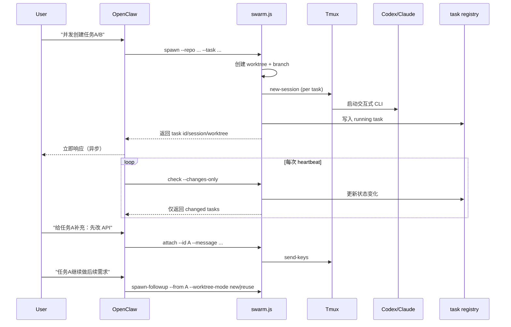

# openclaw-agent-swarm

一个用于 OpenClaw 的多 Agent 编排 Skill：
- 并发启动多个 Coding Agent（Codex / Claude Code）
- 每个任务独立 git worktree + tmux session
- 支持任务中途补充指令（attach）
- 通过 heartbeat 轮询增量状态（`check --changes-only`）
- 对已结束任务支持 follow-up（新建或复用 worktree）
- 支持用户按任务显式指定 `codex` 或 `claude`

## 0. 术语说明

`DoD` 是 `Definition of Done`（完成定义），即任务被判定“真正完成”必须满足的客观标准。  
本项目会自动检查 DoD，包含：
- 任务状态为 `success`
- 任务分支相对 base 分支至少有 1 个提交
- worktree 无未提交改动

## 1. 项目目标

当你在 OpenClaw 主会话里需要并发推进多个开发任务时，这个 skill 提供一个可控、可追踪、可回溯的执行层。

核心设计目标：
- 异步：任务发出后立即返回，不阻塞 OpenClaw 对话
- 隔离：每个任务有自己的 worktree、branch、tmux session
- 可干预：任务跑偏时可中途追加要求
- 可巡检：heartbeat 周期检查状态，只上报变化
- 可续接：已结束任务可以选择新开或复用 worktree 做 follow-up

## 2. 系统架构



## 3. 端到端流程



## 4. 目录结构

```text
.
├── code/                        # 开发源码目录
│   ├── src/swarm.ts             # TypeScript 主实现
│   ├── legacy/swarm.py          # Python 基线实现（对照）
│   ├── scripts/parity-check.ts  # Python/TS 行为一致性检查
│   └── package.json             # 构建工具链
├── scripts/                     # 仓库级自动化脚本
│   ├── build-skill.sh           # 构建并同步运行产物
│   └── regression-swarm-concurrency.sh
├── skills/openclaw-agent-swarm/ # 可直接分发的 skill 目录
│   ├── SKILL.md
│   ├── scripts/swarm.js
│   ├── scripts/check-agents.sh
│   └── references/state-format.md
```

构建流向：`code/src/swarm.ts` -> `code/dist/src/swarm.js` -> `skills/openclaw-agent-swarm/scripts/swarm.js`

## 5. 核心能力与设计细节

### 5.1 任务模型

每个任务记录在：
- `~/.agents/agent-swarm/agent-swarm-tasks.json`

关键字段包括：
- `id`, `agent`, `status`
- `repo`, `worktree`, `branch`, `base_branch`
- `tmux_session`
- `log`, `exit_file`
- `created_at`, `updated_at`, `last_activity_at`
- `dod`（默认 DoD 检查结果）

### 5.2 状态机

状态包含：
- `running`
- `awaiting_input`
- `auto_closing`
- `success`
- `failed`
- `stopped`
- `needs_human`

判定原则：
- `tmux 存活` 不等于任务未结束
- 结束判定结合：日志语义、静默时长、exit file、agent 进程状态
- 自动收敛后尝试释放 tmux session
- 无法安全收敛时转 `needs_human`

### 5.3 DoD（默认内置）

任务要通过 DoD，需满足：
- 状态为 `success`
- 任务分支相对 base 分支至少有 1 个提交
- worktree 干净（无未提交改动）

### 5.4 Follow-up 与 worktree 复用策略

当用户对已结束任务追加需求时：
- 不直接 attach
- 返回 `requires_confirmation`
- 再由 OpenClaw 询问用户选择：
  - `new`: 新建 worktree（推荐，历史清晰）
  - `reuse`: 复用原 worktree（有 guardrail）

`reuse` 保护条件：
- worktree 存在且是 git worktree
- worktree clean
- 原 session 不在运行
- 分支可解析

## 6. 命令接口

先设置 skill 路径：

```bash
SKILL_ROOT="$HOME/.openclaw/skills/openclaw-agent-swarm"
```

推荐运行入口（Node 18+，运行时不依赖 npm 包安装）：

```bash
node "$SKILL_ROOT/scripts/swarm.js" <subcommand> ...
```

从源码构建并更新 skill 运行文件：

```bash
./scripts/build-skill.sh
```

创建任务：

```bash
node "$SKILL_ROOT/scripts/swarm.js" spawn \
  --repo /path/to/repo \
  --task "实现模板复用功能" \
  --agent codex

node "$SKILL_ROOT/scripts/swarm.js" spawn \
  --repo /path/to/repo \
  --task "实现模板复用功能" \
  --agent claude
```

补充要求（运行中任务）：

```bash
node "$SKILL_ROOT/scripts/swarm.js" attach \
  --id 20260305-123456-ab12cd \
  --message "先做 API 层，UI 延后"
```

查询状态：

```bash
node "$SKILL_ROOT/scripts/swarm.js" status --id 20260305-123456-ab12cd
node "$SKILL_ROOT/scripts/swarm.js" status --query templates
```

follow-up（已结束任务）：

```bash
node "$SKILL_ROOT/scripts/swarm.js" spawn-followup \
  --from 20260305-123456-ab12cd \
  --task "补充审查意见修复" \
  --worktree-mode new
```

轮询检查：

```bash
node "$SKILL_ROOT/scripts/swarm.js" check --changes-only
bash "$SKILL_ROOT/scripts/check-agents.sh"
```

发布分支并可选自动创建 PR/MR：

```bash
node "$SKILL_ROOT/scripts/swarm.js" publish \
  --id 20260305-123456-ab12cd \
  --auto-pr
```

显式创建 PR/MR：

```bash
node "$SKILL_ROOT/scripts/swarm.js" create-pr \
  --id 20260305-123456-ab12cd
```

## 7. Heartbeat 集成（重要）

本项目不提供自己的 `HEARTBEAT.md`。
你需要在 **OpenClaw 自带的 `HEARTBEAT.md`** 里配置轮询命令：

```bash
bash "$HOME/.openclaw/skills/openclaw-agent-swarm/scripts/check-agents.sh"
```

建议频率：每 5-10 分钟一次。

## 8. OpenClaw 自然语言映射建议

推荐映射规则：
- “开任务 / 并发开几个任务” -> `spawn`
- “看进度 / 看状态 / 任务怎么样了” -> `status`
- “给这个任务补充要求” -> `attach`
- “这个任务继续做下一步” -> `spawn-followup`
- “检查最近有没有状态变化” -> `check --changes-only`
- “把这个完成任务推到远程并建 PR/MR” -> `publish --auto-pr`
- “给这个任务建 PR/MR” -> `create-pr`

当前已支持在对话中指定 agent：
- “这个任务用 codex” -> `spawn --agent codex`
- “这个任务用 claude” -> `spawn --agent claude`

歧义处理：
- 当 query 命中多个任务时，先返回候选列表，让用户确认 task id。

当 `check` 检测到任务变为 `success` 且 DoD 通过时：
- OpenClaw 需要提示用户是否现在执行 push + PR/MR。
- 默认策略是手动确认后再发布，不在 heartbeat 中自动发布。

## 9. 运行依赖

- `python3`
- `git`（必须）
- `tmux`（必须）
- `codex` 或 `claude` 至少一个

## 10. 安全与运维注意事项

- 当前默认使用 agent CLI 的危险模式参数以避免后台阻塞审批。
- 该设计适合你可控的本地开发环境，不建议直接用于高敏生产环境。
- 任务日志可能包含代码与上下文，请注意本地磁盘安全与清理策略。

## 11. Roadmap

后续可扩展方向：
- PR 与 CI 状态接入（`gh`）
- 自动重试策略（失败分类 + 最大重试次数）
- 外部上下文注入钩子（如 CRM/配置系统）
- 更细粒度的告警策略（仅 human-actionable）
