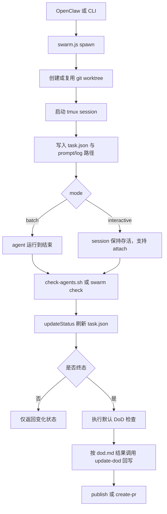

# openclaw-agent-swarm

用于 OpenClaw 的统一任务编排 skill，基于 `git worktree + tmux` 运行多个隔离的 coding agent 任务。

当前仓库只保留一个实现，同时支持两种任务模式：
- `interactive`：长驻 tmux 会话，可 `attach`
- `batch`：非交互执行，不支持 `attach`

英文主文档见 [README.md](../README.md)。

## 架构

现在两种模式走的是同一套任务模型、状态文件和收敛流程，差别只在于 agent 会话是否长期存活，以及是否允许 `attach`。



## DoD 自定义能力

`agent-swarm` 现在支持两层 DoD：

- `swarm.ts` 内置默认 DoD
- 通过 `dod.md` 定义的任务级自定义 DoD

默认 DoD 的硬规则：

- 任务状态必须是终态
- worktree 必须 clean
- `required_tests` 中每条命令都必须返回 `0`

自定义 DoD 的推荐流程：

1. 在任务上下文中维护 `dod.md`
2. 任务终态后，由 OpenClaw 或外部流程读取 `dod.md`
3. 执行额外语义校验
4. 通过 `update-dod` 把结果回写进任务状态

`dod.md` 示例：

```md
# DoD

- `/healthz` 返回 200
- `npm test` 通过
- `README.md` 已补充新安装步骤
```

回写示例：

```bash
node "$SKILL_ROOT/scripts/swarm.js" update-dod \
  --id <task-id> \
  --status pass \
  --result '{"summary":"dod.md 检查通过","error":""}'
```

约定：

- `dod.status` 只有 `pass|fail`
- 系统异常统一写入 `dod.result.error`
- `required_tests` 是 `spawn` 时传入的命令级强规则

## 环境要求

- macOS 或 Linux
- Node.js `>= 18`
- `git`
- `tmux`
- 至少安装一个 agent CLI，并且在 `PATH` 中可用
- 当前支持：`codex`、`claude`

目标目录必须已经是 git 仓库，否则 `agent-swarm` 会拒绝执行。

## 安装

从 GitHub 克隆：

```bash
git clone https://github.com/youzaiAGI/openclaw-agent-swarm-skills.git
cd openclaw-agent-swarm-skills
```

安装构建依赖：

```bash
cd code
npm install
cd ..
```

构建运行产物：

```bash
./scripts/build-skill.sh
```

把生成后的 skill 安装到 OpenClaw 目录：

```bash
mkdir -p "$HOME/.openclaw/skills"
rm -rf "$HOME/.openclaw/skills/openclaw-agent-swarm"
cp -R skills/openclaw-agent-swarm "$HOME/.openclaw/skills/openclaw-agent-swarm"
```

## 快速开始

如果你只想先安装并跑起一个任务，可以直接走这条最短路径。

先设置安装后的 skill 根目录：

```bash
SKILL_ROOT="$HOME/.openclaw/skills/openclaw-agent-swarm"
```

启动一个 batch 任务：

```bash
node "$SKILL_ROOT/scripts/swarm.js" spawn \
  --repo /path/to/repo \
  --mode batch \
  --task "实现功能 X" \
  --agent codex \
  --required-test "npm test"
```

查看任务状态：

```bash
node "$SKILL_ROOT/scripts/swarm.js" status --id <task-id>
```

如果任务使用了 `dod.md`，在校验完成后回写 DoD 结果：

```bash
node "$SKILL_ROOT/scripts/swarm.js" update-dod \
  --id <task-id> \
  --status pass \
  --result '{"summary":"dod.md 检查通过","error":""}'
```

发布完成后的分支：

```bash
node "$SKILL_ROOT/scripts/swarm.js" publish --id <task-id> --auto-pr
```

## 运行目录

生成的 skill 目录：

- `skills/openclaw-agent-swarm/SKILL.md`
- `skills/openclaw-agent-swarm/scripts/swarm.js`
- `skills/openclaw-agent-swarm/scripts/check-agents.sh`

本地运行时状态目录：

- `~/.agents/agent-swarm/tasks/<task-id>.json`
- `~/.agents/agent-swarm/tasks/history/<yyyy-mm-dd>/<task-id>.json`
- `~/.agents/agent-swarm/logs/<task-id>.log`
- `~/.agents/agent-swarm/logs/<task-id>.exit`
- `~/.agents/agent-swarm/prompts/<task-id>.txt`
- `~/.agents/agent-swarm/worktree/<repo-name>/<task-id>/`
- `~/.agents/agent-swarm/agent-swarm-last-check.json`

## 命令用法

先设置安装后的 skill 根目录：

```bash
SKILL_ROOT="$HOME/.openclaw/skills/openclaw-agent-swarm"
```

主入口：

```bash
node "$SKILL_ROOT/scripts/swarm.js" <command> ...
```

`spawn`

`spawn` 用于新建任务并创建新 worktree，是 `batch` 和 `interactive` 的统一入口。

创建 batch 任务：

```bash
node "$SKILL_ROOT/scripts/swarm.js" spawn \
  --repo /path/to/repo \
  --mode batch \
  --task "实现功能 X" \
  --agent codex \
  --required-test "npm test"
```

如果任务必须满足命令级校验，再让 DoD 通过，就使用 `--required-test`。

创建 interactive 任务：

```bash
node "$SKILL_ROOT/scripts/swarm.js" spawn \
  --repo /path/to/repo \
  --mode interactive \
  --task "排查并修复问题 Y" \
  --agent claude
```

`attach`

`attach` 只用于还在运行中的 `interactive` 任务，用来向当前 tmux 会话补充要求。

给运行中的 interactive 任务补充要求：

```bash
node "$SKILL_ROOT/scripts/swarm.js" attach \
  --id <task-id> \
  --message "先收敛 API 层，不处理 UI"
```

`spawn-followup`

`spawn-followup` 用于在旧任务已经结束后继续派生新任务。`new` 表示新 worktree，`reuse` 表示在守卫通过时复用旧 worktree。

对已结束任务创建 follow-up：

```bash
node "$SKILL_ROOT/scripts/swarm.js" spawn-followup \
  --from <task-id> \
  --worktree-mode new \
  --task "根据 review 意见继续修改"
```

`status` 与 `check`

`status` 适合单任务查询，`check --changes-only` 适合轮询、heartbeat 或增量更新。

检查状态：

```bash
node "$SKILL_ROOT/scripts/swarm.js" status --id <task-id>
node "$SKILL_ROOT/scripts/swarm.js" check --changes-only
```

`update-dod`

`update-dod` 用于在 `dod.md` 的自定义校验完成后，把语义级结果写回任务状态。

更新 DoD：

```bash
node "$SKILL_ROOT/scripts/swarm.js" update-dod \
  --id <task-id> \
  --result-file /path/to/dod-result.json
```

`cancel`

`cancel` 用于手动停止运行中的任务，并让它收敛到 `stopped`。

取消任务：

```bash
node "$SKILL_ROOT/scripts/swarm.js" cancel --id <task-id> --reason "手动停止"
```

`publish` 与 `create-pr`

`publish` 用于在任务完成且 DoD 通过后推送分支。`create-pr` 用于显式创建 PR，而不是直接用 `publish --auto-pr`。

发布或创建 PR：

```bash
node "$SKILL_ROOT/scripts/swarm.js" publish --id <task-id> --auto-pr
node "$SKILL_ROOT/scripts/swarm.js" create-pr --id <task-id>
```

## OpenClaw 集成

如果你需要周期性收敛任务状态，请在 OpenClaw heartbeat 中调用 skill 内脚本：

```bash
bash "$HOME/.openclaw/skills/openclaw-agent-swarm/scripts/check-agents.sh"
```

这个脚本使用 `flock` 保证同一时刻只运行一个检查周期。

## Star History

[](https://www.star-history.com/#youzaiAGI/openclaw-agent-swarm-skills&Date)
