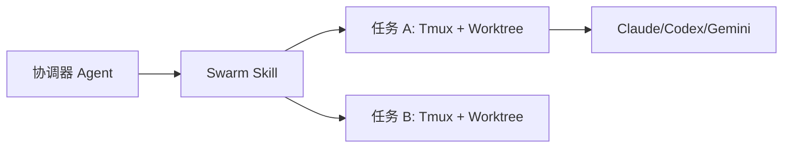

# OpenClaw Agent Swarm

[](LICENSE)
[](../code/src/swarm.ts)

**OpenClaw Agent Swarm** 是一个统一的执行层，用于在隔离、异步的环境中编排 AI 编程 Agent（如 Codex、Claude Code 和 Gemini）。

[English](../README.md) | 简体中文

---

## 🚀 核心特性

- **物理隔离执行**：为每个任务自动创建独立的 Git Worktree 和 Branch，确保开发环境互不干扰。
- **异步任务调度**：支持长时运行的后台任务（Batch 模式）或实时的人机协同交互（Interactive 模式）。
- **增量状态监控**：提供心跳轮询机制，仅上报状态发生变化的 Task，降低监控开销。
- **DoD 质量驱动**：内置并可扩展的「完成定义 (Definition of Done)」检查，确保代码变更符合质量标准。
- **多 Agent 支持**：为 Codex、Claude Code 和 Gemini 提供统一的命令行调用接口。

---

## 🏗️ 架构概览

Swarm 通过多层隔离机制确保 Agent 执行过程的安全与可控：




---

## 🛠️ 快速上手

### 环境要求
- **操作系统**: macOS 或 Linux
- **Node.js**: >= 18
- **依赖工具**: `git`, `tmux`, 以及至少一个 Agent CLI (`codex`, `claude` 或 `gemini`)。

### 安装步骤
```bash
# 克隆仓库
git clone https://github.com/youzaiAGI/openclaw-agent-swarm-skills.git
cd openclaw-agent-swarm-skills

# 从源码构建
cd code && npm install && npm run build
cd ..

# 部署 Skill 产物
./scripts/build-skill.sh
```

---

## 📖 文档索引

关于详细指南和参考资料，请参阅以下文档（目前仅提供英文版）：

### 🏁 [快速入门 (Getting Started)](getting-started.md)
安装、配置及运行第一个任务的分步说明。

### 🏛️ [架构设计 (Architecture)](architecture.md)
深入了解 Swarm 如何利用 Git Worktree、Tmux 和本地状态实现任务隔离与执行。

### 📜 [CLI 参考手册 (CLI Reference)](cli-reference.md)
`swarm.js` 工具中每个子命令及参数的完整说明。

### ✅ [DoD 工作流 (DoD Workflow)](dod-workflow.md)
「完成定义」流程详解，包含自动化测试和语义化检查。

### 🤖 [Agent 集成 (Agent Integration)](agent-integration.md)
在 Swarm 中配置和使用不同 AI 编程 Agent 的指南。

### 🛠️ [问题排查 (Troubleshooting)](troubleshooting.md)
常见问题、错误信息及其对应的解决方案。

---

## 🤝 参与贡献

欢迎提交 Issue 或 Pull Request。在修改核心逻辑时，请务必注意：
1. 修改 `code/src/swarm.ts` 中的 TypeScript 源码。
2. 运行 `npm run build` 同步编译生成的 JavaScript。
3. 使用 `scripts/` 目录下的回归脚本验证你的更改。

---

## 📄 开源协议

本项目采用 [MIT License](LICENSE) 协议。
