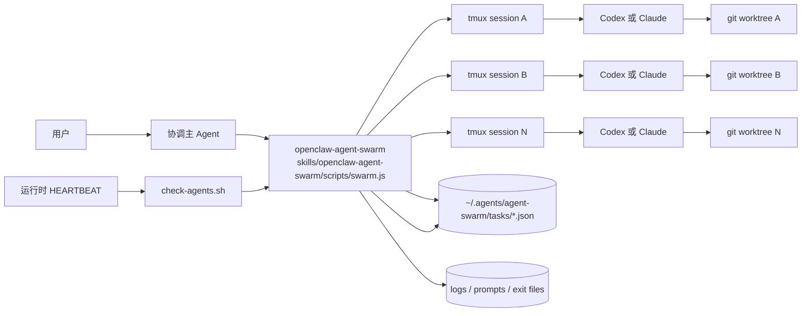
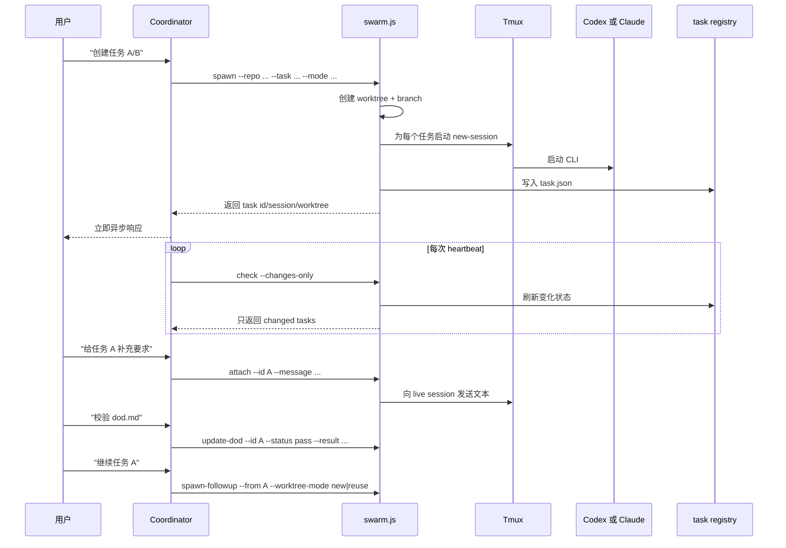

# openclaw-agent-swarm

[English](../README.md) | 简体中文

一个可供 OpenClaw、Codex、Claude Code 等运行时调用的多 Agent 编排 Skill：
- 用统一运行时管理 `codex` 和 `claude` 任务
- 每个任务独立 `git worktree + tmux session`
- 同时支持 `interactive` 与 `batch` 两种模式
- 支持运行中交互任务补充指令
- 通过 heartbeat 轮询增量状态
- 支持内置 DoD 与 `dod.md` 自定义完成定义

本仓库现在只提供一个 skill：
- `openclaw-agent-swarm`

两种模式都通过同一个入口实现：
- `interactive`：长驻 tmux，会话中可 `attach`
- `batch`：非交互执行，不支持中途 `attach`

## 0. 术语说明

`DoD` 是 `Definition of Done`，即任务被认定为真正完成必须满足的客观标准。

本项目支持两层 DoD：
- `swarm.ts` 内置默认 DoD
- 通过 `dod.md` 定义的任务级自定义 DoD，并用 `update-dod` 回写结果

任务状态固定为：
- `running`
- `pending`
- `success`
- `failed`
- `stopped`

## 1. 项目目标

当任意协调型 Agent/运行时需要异步推进一个或多个工程任务时，这个 skill 提供一个可控、可追踪、可回写状态的执行层。

核心设计目标：
- 异步：`spawn` 立即返回，不阻塞主对话
- 隔离：一个任务对应一个 worktree、branch、tmux session
- 统一：同一套运行时同时支持 `interactive` 和 `batch`
- 可干预：交互任务运行中可通过 `attach` 追加要求
- 可巡检：`check --changes-only` 只回报变化
- 可扩展：命令级强校验由 `required_tests` 负责，语义级验收由 `dod.md` 负责

## 2. 系统架构



## 3. 端到端流程



## 4. 目录结构

```text
.
├── code/                                # 源码目录
│   ├── src/swarm.ts                     # TypeScript 主实现
│   ├── package.json                     # 构建工具链
│   └── tsconfig.json
├── scripts/
│   ├── build-skill.sh                   # 构建并同步运行产物
│   ├── regression-swarm-concurrency.sh  # 运行时回归脚本
│   └── README.md
├── skills/openclaw-agent-swarm/         # 可直接分发的 skill 目录
│   ├── SKILL.md
│   ├── scripts/swarm.js
│   ├── scripts/check-agents.sh
│   └── references/
│       ├── dod.md
│       └── state-format.md
├── docs/
│   └── README.zh-CN.md
└── legacy/                              # 重构前代码和旧文档保留区
```

构建流向：
- `code/src/swarm.ts` -> `skills/openclaw-agent-swarm/scripts/swarm.js`

## 5. 核心能力与设计细节

### 5.1 任务模型

任务存储在：
- `~/.agents/agent-swarm/tasks/<task_id>.json`

关键字段：
- `id`, `mode`, `agent`, `status`
- `repo`, `worktree`, `branch`, `base_branch`
- `tmux_session`
- `task`, `parent_task_id`
- `required_tests`
- `created_at`, `updated_at`, `last_activity_at`, `timeout_since`
- `log`, `exit_file`, `exit_code`, `result_excerpt`
- `dod`, `publish`, `pr`, `cancel`

### 5.2 状态机

状态包括：
- `running`
- `pending`
- `success`
- `failed`
- `stopped`

判定原则：
- `batch` 主要依据 exit file 与 tmux 存活状态收敛
- `interactive` 在 session 存活期间保持可 `attach`
- 终态任务在刷新时会重新执行默认 DoD 检查
- `check --changes-only` 基于 `last-check.json` 做增量返回

### 5.3 DoD

默认 DoD 通过条件：
- 任务状态必须是终态
- worktree 必须 clean
- `required_tests` 中每条命令都必须返回 `0`

自定义 DoD 流程：
- 在任务上下文中维护 `dod.md`
- 任务结束后读取并校验 `dod.md`
- 用 `update-dod` 写回 `pass|fail`

约定：
- `dod.status` 只有 `pass|fail`
- 系统异常统一写入 `dod.result.error`

### 5.4 Follow-up 与 worktree 复用

当已结束任务需要继续推进时：
- 不直接 `attach`
- 返回 follow-up 选择
- 用户可以选择：
  - `new`：新建 worktree 和 branch
  - `reuse`：在守卫通过时复用旧 worktree

`reuse` 守卫条件：
- worktree 仍存在且是 git worktree
- worktree clean
- 父 tmux session 不在运行
- 分支仍可解析

## 6. 快速开始

安装 skill：

```bash
git clone https://github.com/youzaiAGI/openclaw-agent-swarm-skills.git
cd openclaw-agent-swarm-skills
cd code
npm install
cd ..
./scripts/build-skill.sh
mkdir -p "$HOME/.openclaw/skills"
rm -rf "$HOME/.openclaw/skills/openclaw-agent-swarm"
cp -R skills/openclaw-agent-swarm "$HOME/.openclaw/skills/openclaw-agent-swarm"
```

设置 skill 根目录：

```bash
SKILL_ROOT="$HOME/.openclaw/skills/openclaw-agent-swarm"
```

启动一个 batch 任务：

```bash
node "$SKILL_ROOT/scripts/swarm.js" spawn \
  --repo /path/to/repo \
  --mode batch \
  --task "实现功能 X" \
  --agent codex \
  --required-test "npm test"
```

查看进度：

```bash
node "$SKILL_ROOT/scripts/swarm.js" status --id <task-id>
```

如果任务使用了 `dod.md`，回写 DoD 结果：

```bash
node "$SKILL_ROOT/scripts/swarm.js" update-dod \
  --id <task-id> \
  --status pass \
  --result '{"summary":"dod.md 检查通过","error":""}'
```

发布完成后的分支：

```bash
node "$SKILL_ROOT/scripts/swarm.js" publish --id <task-id> --auto-pr
```

## 7. 命令接口

设置 skill 根目录：

```bash
SKILL_ROOT="$HOME/.openclaw/skills/openclaw-agent-swarm"
```

主入口：

```bash
node "$SKILL_ROOT/scripts/swarm.js" <subcommand> ...
```

`spawn`

`spawn` 用于在新 worktree 中创建任务，是 `batch` 和 `interactive` 的统一入口。

```bash
node "$SKILL_ROOT/scripts/swarm.js" spawn \
  --repo /path/to/repo \
  --mode batch \
  --task "实现模板复用功能" \
  --agent codex \
  --required-test "npm test"
```

```bash
node "$SKILL_ROOT/scripts/swarm.js" spawn \
  --repo /path/to/repo \
  --mode interactive \
  --task "排查并修复问题 Y" \
  --agent claude
```

`attach`

`attach` 只适用于仍在运行的 `interactive` 任务。

```bash
node "$SKILL_ROOT/scripts/swarm.js" attach \
  --id <task-id> \
  --message "先做 API 层"
```

`spawn-followup`

`spawn-followup` 用于从已结束任务继续派生新任务。

```bash
node "$SKILL_ROOT/scripts/swarm.js" spawn-followup \
  --from <task-id> \
  --task "根据 review 意见继续修改" \
  --worktree-mode new
```

```bash
node "$SKILL_ROOT/scripts/swarm.js" spawn-followup \
  --from <task-id> \
  --task "继续在原分支上修改" \
  --worktree-mode reuse
```

`status` 与 `check`

`status` 适合查单个任务，`check --changes-only` 适合轮询与 heartbeat。

```bash
node "$SKILL_ROOT/scripts/swarm.js" status --id <task-id>
node "$SKILL_ROOT/scripts/swarm.js" status --query keyword
node "$SKILL_ROOT/scripts/swarm.js" check --changes-only
node "$SKILL_ROOT/scripts/swarm.js" list
```

`update-dod`

`update-dod` 用于在 `dod.md` 自定义校验完成后回写结果。

```bash
node "$SKILL_ROOT/scripts/swarm.js" update-dod \
  --id <task-id> \
  --status pass \
  --result '{"summary":"dod.md 检查通过","error":""}'
```

`cancel`

`cancel` 用于手动停止运行中的任务，并让它收敛到 `stopped`。

```bash
node "$SKILL_ROOT/scripts/swarm.js" cancel \
  --id <task-id> \
  --reason "手动停止"
```

`publish` 与 `create-pr`

任务结束且 DoD 通过后，使用 `publish` 推送分支；如果要显式创建 PR，则使用 `create-pr`。

```bash
node "$SKILL_ROOT/scripts/swarm.js" publish \
  --id <task-id> \
  --auto-pr
```

```bash
node "$SKILL_ROOT/scripts/swarm.js" create-pr \
  --id <task-id>
```

## 8. Heartbeat 集成

在你的运行时 heartbeat 中配置以下命令：

```bash
bash "$HOME/.openclaw/skills/openclaw-agent-swarm/scripts/check-agents.sh"
```

这个 wrapper 使用 `flock`，保证同一时刻只有一个检查周期在运行。

推荐用法：
- 由运行时 heartbeat 周期调用
- 配合 `check --changes-only` 做增量状态上报

如果运行时使用 `HEARTBEAT.md`，请确保包含以下命令：

```bash
bash "$HOME/.openclaw/skills/openclaw-agent-swarm/scripts/check-agents.sh"
```

## 9. 自然语言映射建议

推荐映射：
- “并发创建任务” -> `spawn`
- “查看进度” -> `status`
- “给这个任务补充要求” -> `attach`
- “取消这个任务” -> `cancel --id`
- “继续这个已结束任务” -> `spawn-followup`
- “检查最近变化” -> `check --changes-only`
- “发布这个完成任务” -> `publish --auto-pr`
- “给这个任务创建 PR” -> `create-pr`

当前支持在对话里显式指定 agent：
- “这个任务用 codex” -> `spawn --agent codex`
- “这个任务用 claude” -> `spawn --agent claude`

## 10. 运行依赖

- macOS 或 Linux
- Node.js `>= 18`
- `git`
- `tmux`
- `codex` 或 `claude` 至少一个

目标路径必须已经是 git 仓库。

## 11. 安全与运维注意事项

- 运行时设计面向可信的本地开发环境。
- 后台任务日志可能包含代码和上下文，请自行制定保留与清理策略。
- `skills/` 下生成的 `.js` 文件属于运行产物，不应直接手改。

## 12. Star History

[](https://www.star-history.com/#youzaiAGI/openclaw-agent-swarm-skills&Date)
